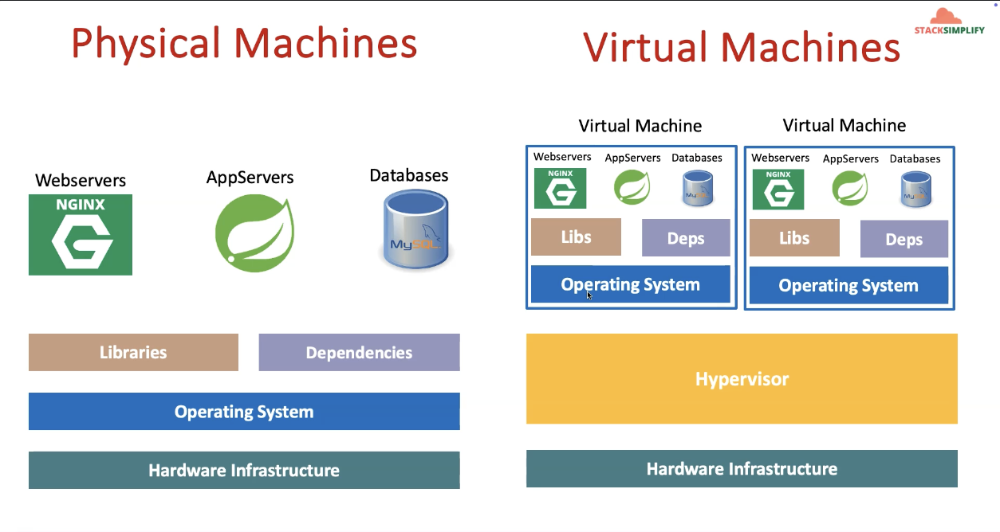
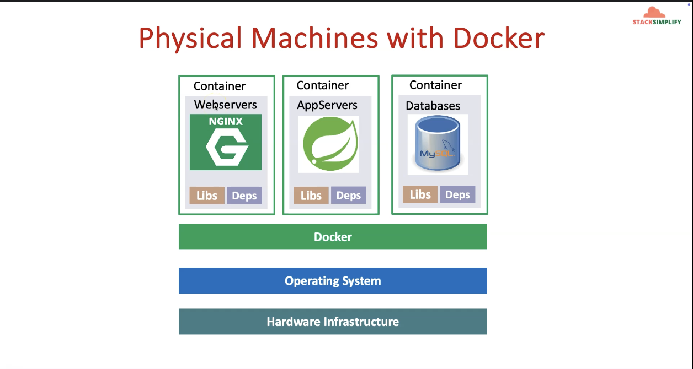

Episode - 1

Traditional Approach 
Installation & Configuration 
    Time consuming
    Need to perform install/configs on every server and every environment (dev, qa, staging, production)
Compatibility & Dependency
    Need to keep resolving issues related to libraries and dependencies
Inconsistencies across Environments
    Very hard to track changes across Dev/QA/Staging and Prod environments and they end up with inconsistencies 
Operational Support
    Need more resources to handle operational issues on day to day basis
        Server Support (hardware, software) Patching releases
Developer Environments
    When a new developer joins the team, time it takes to provision his development environment in traditional approach is time taking.

Advantages of using Docker

Flexible -- Complex app can be easily containerized

Lightweight -- Containers use fewer resources than VM

Portable -- You can build locally, deploy to the cloud, and run anywhere

Loosely Coupled -- Replace or upgrade containers without affecting others.

Scalable -- Easily scale containers across data centers.

Secure -- Containers Provide isolation without extra setup 

Episode - 2

Docker - Terminology

Docker Daemon:
The docker daemon listens for docker API requests and manages Docker objects such as images, containers, networks, and volumes

Docker Client:
 - Can be present on either docker host or any other machines.
 - through docker client we can connect to docker daemon.

Docker Images:
 - read-only template with instructions for creating a docker container.
 - we want to add custom configs in nginx, then we take base nginx image and modify as per our need. 

Docker Containers:
 - A container is a runnable instance of an image.
 - we can create start stop, move or delete a container using the docker API or CLI.

Docker Hub:
 - Register images.
 - we can pull or push our custom images.(Kind of github )