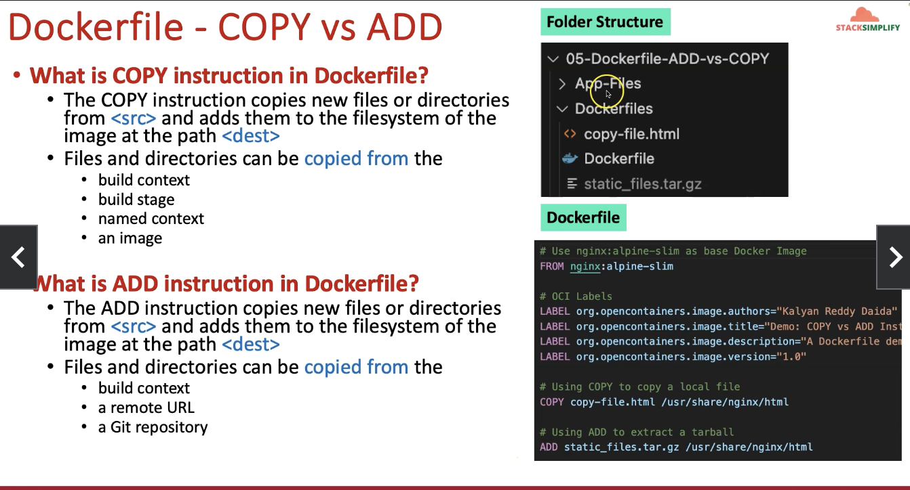
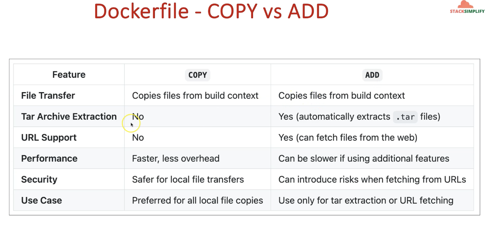

# Dockerfile - COPY vs ADD

# What is COPY instruction in Dockerfile?
- The COPY instruction copies new files or directories from <src> and adds them to the filesystem of the image at the path <dest>
- Files and directories can be copied from the ⚫ build context
    • build stage
    • named context 
    • an image

# What is ADD instruction in Dockerfile?
- The ADD instruction copies new files or directories from <src> and adds them to the filesystem of the image at the path <dest>
- Files and directories can be copied from the 
    • build context
**    • a remote URL
    • a Git repository
    • Unzip the file during the build time**

## 99% we use COPY command in dockerfile.

COPY index.html /usr/share/nginx/html
ADD index.tar.gz /usr/share/nginx/html

# Dockerfile - ADD Instruction

Add: fetch from URL Demo
- To add files from a remote location, you can specify a 
  URL or Git Release

# Dockerfile - ARD Instruction

What is ARG instruction in Dockerfile?
- Define a variable that users can pass at build-time to the builder with
  - Docker Command: docker build
  - Using the flag: --build-arg<varname>=<value>
- We can define one or more ARG instructions

ARG NGINX_VERSION= 1.26

FROM nginx:${NGINX_VERSION}-alpine-slim

COPY index.html/usr/share/html/nginx

# Dockerfile - RUN and EXPOSE Instruction

# Run Instruction:
- Will execute any commands to create a new layer on top of the current image.

FROM nginx:alpine-slim

# Copy all Nginx configuration files from nginx-conf directory
COPY nginx-conf/*.conf /etc/nginx/conf.d/

# Copy all HTML files from nginx-html directory
COPY nginx-html/*.html /usr/share/nginx/html/

# Install curl using RUN
RUN apk --no-cache add curl

# Expose the ports 8081, 8082, 8083 (default port 80 already exposed from base nginx image)
EXPOSE 8081 8082 8083

# EXPOSE Instruction: 
- Informs Docker that the container listens on the specified network ports at runtime. 